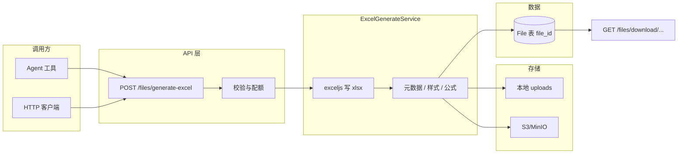

# Excel 生成服务 — 可落地设计说明

> 目标：提供**统一服务端能力**，将结构化 JSON 转为 `.xlsx`，与现有 `files` 存储、鉴权、下载链路对齐；Agent / 其它系统只提交数据，不关心实现细节。  
> 与现有能力关系：**解析 Excel**（`ExcelParseService`、RAG）为读路径；本文为**写路径**，独立服务模块。

---

## 1. 核心思路

| 层级 | 职责 |
|------|------|
| **调用方**（Agent / 内部任务 / 管理端） | 提交 `sheets[]` + 可选样式/公式/文件名；只处理业务数据。 |
| **生成服务**（本设计） | 校验 → 用库写工作簿 → 落盘或上传对象存储 → 登记 `File` 记录 → 返回 `file_id`。 |
| **下载 / 预览** | 复用现有 `GET /api/files/download/:userId/:file_id`（`?original=1`）与前端 Blob 预览；**不**在生成接口返回长期裸 URL。 |

**原则**：生成接口**不**返回带 query token 的永久外链；统一返回 `file_id`，由客户端用**已登录会话**请求下载（与当前产品一致，避免链接泄露）。

---

## 2. 架构



- **模块位置建议**：`api/server/services/Files/ExcelGenerateService.js`（与 `ExcelParseService` 对称）。  
- **路由**：`api/server/routes/files/files.js` 增加 `router.post('/generate-excel', ...)`，或独立 `generated.js` 由 `files/index.js` 挂载为 `/files/generate-excel`。  
- **依赖**：Node 侧推荐 **exceljs**（多 sheet、样式、公式、列宽；社区活跃）。读侧已用 **xlsx (SheetJS)**，写侧不必与读同库。

---

## 3. API 设计

### 3.1 生成

`POST /api/files/generate-excel`

| 项 | 说明 |
|----|------|
| **鉴权** | 与现有 API 一致：`Authorization: Bearer <access_token>`；可选叠加 `checkPermission`（见 §5）。 |
| **Content-Type** | `application/json` |
| **Body 上限** | 服务端配置 `maxGenerateExcelBodyBytes`（如 2MB），超限 413。 |

**请求体（逻辑模型）**

```json
{
  "fileName": "月度报表.xlsx",
  "ttlHours": 72,
  "context": "message_attachment",
  "sheets": [
    {
      "name": "销售数据",
      "columns": ["地区", "销量", "增长率"],
      "rows": [
        ["北京", 123, 0.05],
        ["上海", 98, 0.12]
      ],
      "styles": {
        "headerBold": true,
        "headerBg": "#E0E0E0",
        "columnWidths": [12, 10, 12],
        "numberFormats": { "C": "0.00%" },
        "freezeFirstRow": true
      },
      "formulas": [
        { "ref": "D11", "formula": "SUM(B2:B10)" }
      ]
    }
  ]
}
```

**设计说明（落地时二选一写清）**

1. **数据形态**  
   - **方案 A（推荐）**：`columns` + `rows: any[][]`，表头与类型清晰，便于设列格式与公式列字母。  
   - **方案 B**：`data: object[]`（行对象），服务端按首行或 `columns` 推断列顺序；与 Agent 输出 JSON 更贴近，但列顺序需明确约定。

2. **`fileName`**  
   - 仅允许扩展名 `.xlsx` / `.xls`（若只支持 xlsx 则强制 `.xlsx`）；经 `sanitizeFilename` 与路径穿越校验。

3. **`ttlHours`**（可选）  
   - 写入 `File.expiresAt` 或独立 `generated_files` 表；定时任务或上传时清理（与现有 `expiresAt` 模式对齐）。

4. **`context`**（可选）  
   - 枚举：`message_attachment` | `agent_output` | `system`；写入 `File.context`，便于审计与策略。

**响应（200）**

```json
{
  "file_id": "uuid",
  "filename": "月度报表.xlsx",
  "bytes": 12800,
  "mimeType": "application/vnd.openxmlformats-officedocument.spreadsheetml.sheet"
}
```

**不返回** `download_url` 带 token 的长链；前端使用：

`GET /api/files/download/${userId}/${file_id}?original=1`  
（与现有鉴权、 `fileAccess` 中间件一致。）

**错误码建议**

| HTTP | 含义 |
|------|------|
| 400 | JSON Schema 校验失败、sheet 名非法、行列超限 |
| 401 | 未登录 |
| 403 | 无权限（角色/Agent 能力未开） |
| 413 | Body 过大 |
| 500 | 生成或存储失败 |

---

### 3.2 下载（复用）

- `GET /api/files/download/:userId/:file_id?original=1`  
- 与现有 `fileAccess` 一致：仅资源所有者或被授权 Agent/会话可下。

---

### 3.3 可选：OpenAPI / JSON Schema

- 在 `packages/data-schemas` 或 `api` 侧增加 `GenerateExcelBodySchema`（zod），便于前端与 Agent 工具共用同一校验规则。

---

## 4. 服务端实现要点（exceljs）

| 能力 | 实现要点 |
|------|----------|
| 多 Sheet | `workbook.addWorksheet(name)`，名称唯一、长度限制（31 字符 Excel 限制）。 |
| 表头行 | 首行写入 `columns` 或推断；`headerBold` / `headerBg` 应用 `row.getCell().font/fill`。 |
| 数字格式 | `numFmt: '#,##0'`, `'0.00%'` 等，按列或按 `numberFormats`。 |
| 列宽 | `worksheet.getColumn(i).width`。 |
| 公式 | `cell.value = { formula: 'SUM(B2:B10)', result: undefined }`（或仅 formula，由 Excel 打开时计算）。 |
| 行数/列数 | 硬限制：`MAX_ROWS`（如 100_000）、`MAX_COLS`（如 256）、`MAX_SHEETS`（如 32），可配置。 |

**写完后**：Buffer → 走现有 `handleFileUpload` / `createFile` 流程，设置 `type: xlsx`、`source: local`（或统一 `generated_excel` 枚举若后续扩展）、`user`、`filename`、`bytes`、`filepath`。

---

## 5. 权限与安全

| 维度 | 建议 |
|------|------|
| **鉴权** | 必须登录；与 `POST /files` 同级或更严。 |
| **权限位** | 新增 `PermissionBits` 或复用「文件上传」能力；Agent 侧通过 `AgentCapabilities.generate_excel`（或复用 `execute_code` 同级配置）控制是否暴露工具。 |
| **用户隔离** | 生成文件 `user: req.user.id`；`fileAccess` 保证不可越权下载他人 `file_id`。 |
| **输入** | JSON Schema：嵌套深度、字符串长度、`sheets[].name` 白名单字符；禁止公式注入执行任意函数——**仅允许以 `=` 开头的 Excel 公式字符串**，可正则校验 `^=[A-Z0-9_:(),.+\-*/\s"<>&]+$`（按需收紧）。 |
| **资源耗尽** | 行列数、sheet 数、Body 大小、单用户 QPS / 日配额（Redis 计数）。 |
| **审计** | 记录 `userId`、`file_id`、生成字节数、耗时、可选 `agent_id` / `conversation_id`（从 body 或 header 传入）。 |
| **临时文件** | 若先写 temp 再上传，须在 `finally` 删除 temp；管道错误也要 unlink。 |

**不推荐**：在响应里返回长期有效的 signed URL；若必须给外部系统，用**短 TTL**（如 5 分钟）的 signed GET，与现有 S3 策略对齐。

---

## 6. 前端集成

| 场景 | 做法 |
|------|------|
| **下载** | `POST /generate-excel` 得 `file_id` → `dataService.getFileDownload(userId, file_id, { original: true })` → `Blob` → `URL.createObjectURL` + `<a download>` 或 FileSaver。 |
| **预览** | 已有 `SpreadsheetNativeViewer`（SheetJS 读 Blob）；生成成功后拉 Blob 即复用。 |
| **Agent 消息内展示** | 与代码执行产出文件类似：SSE `attachment` 事件带 `file_id`，气泡展示「生成的 Excel」卡片 + 下载/预览。 |

---

## 7. Agent 集成

| 方式 | 说明 |
|------|------|
| **HTTP 工具** | 工具内 `fetch(apiBase + '/api/files/generate-excel', { method:'POST', headers, body })`，使用服务端注入的 user token 或 **内部 service JWT**（仅服务端 Agent 运行时）。 |
| **内部函数** | Agent 运行时同进程则直接 `ExcelGenerateService.generateFromSpec(req, spec)`，避免 HTTP 开销。 |

工具描述中明确：**输出为 `file_id`**，由 UI 负责下载；模型不要在回复里伪造下载链接。

---

## 8. 扩展性

| 方向 | 做法 |
|------|------|
| **报表模板** | 第二阶段：`templateId` + `payload` 仅填单元格映射；模板存 OSS + 版本号。 |
| **批量导出** | 多个 spec 一次请求返回 `file_id[]`，或生成 zip（新接口 `POST /files/generate-archive`）。 |
| **多格式** | 同入口增加 `format: 'xlsx' | 'csv' | 'ods'`，或独立轻量 CSV 接口。 |
| **异步大任务** | Body 超阈值时返回 `job_id`，轮询 `GET /files/jobs/:id` 取 `file_id`（与现有多步任务模式对齐）。 |

---

## 9. 落地清单（建议迭代顺序）

### 已实现（MVP）

- **依赖**：`api/package.json` 已增加 `exceljs`。  
- **服务**：`api/server/services/Files/ExcelGenerateService.js`（校验、`exceljs` 写盘、`createFile`、可选 `ttlHours` → `expiresAt`）。  
- **路由**：`POST /api/files/generate-excel`（挂载在 `/api/files` 下，需 JWT；`express.json`，上限 `MAX_GENERATE_EXCEL_BODY` 默认 `2mb`），见 `api/server/routes/files/files.js`。  
- **客户端封装**：`packages/data-provider` → `dataService.generateExcel(body)`、`GenerateExcelBody` / `GenerateExcelResult` 类型。  
- **Agent 工具**：`api/app/clients/tools/structured/GenerateExcel.js`（`generate_excel`）+ `manifest.json` + `handleTools.js`；`content_and_artifact` 返回 `[JSON, { generate_excel: { file_id, … } }]`。`createToolEndCallback` 查库后推送 `attachment`；**注意**：LangGraph 流式 `on_tool_end` 里 `ToolMessage` 常丢失 `artifact`，回调已增加对 **`generate_excel` + `content` JSON** 的兜底解析 `file_id`，否则附件事件不会发出。  
- **前端联调页**：登录后访问 **`/excel-demo`**（`client/src/routes/ExcelGenerateDemo.tsx`）：编辑 JSON → 生成 → 下载 / 表格预览（`SpreadsheetNativeViewer` + `getFileDownload(..., { original: true })`）。  
- **测试**：`ExcelGenerateService.spec.js`（校验）；`GenerateExcel.spec.js`（工具 `_call`）。

### 待迭代

1. **权限**：可选独立 `PermissionBits` / 端点能力项（当前与文件类接口一致，依赖 JWT + 既有文件下载权限）。  
2. **多存储**：当前写入 **本地 uploads**；生产若主用 S3，需对齐 `saveBufferToS3` 等与 `fileStrategy` 一致的路径。  
3. **异步大表**：超阈值走 `job_id` 轮询等（见上文「扩展性」）。  

---

## 10. 与现有代码的映射

| 现有能力 | 复用方式 |
|----------|----------|
| 文件元数据 | `~/models/File` `createFile` |
| 下载 | `GET .../download/:userId/:file_id` + `fileAccess` |
| 文件名 | `~/server/utils/files` `sanitizeFilename` |
| 读 Excel | `ExcelParseService`（与本服务独立，可共享常量如 MIME） |

---

*本文档为设计约束与接口契约；实现时以代码审查与 OpenAPI 为准。*
