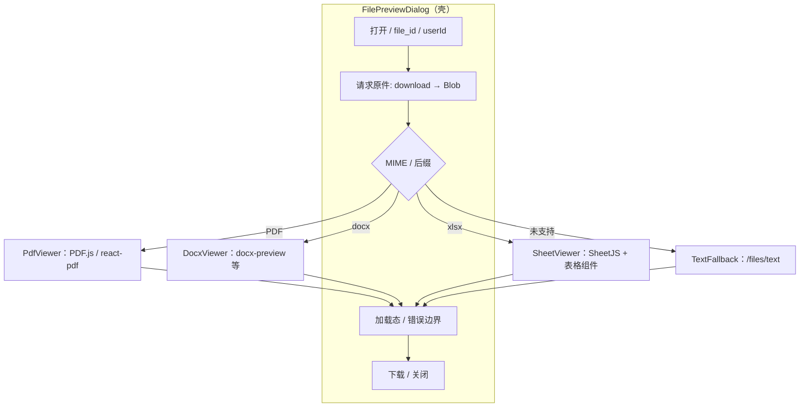

# 聊天附件：原生预览架构说明

## 1. 范围与原则（文档级约定）

**RAG / Agent / 文本类接口继续沿用 `GET /api/files/text/:userId/:file_id`**：返回解析后的纯文本（及现有向量化、重试等逻辑），不因「原生预览」而改动语义。

**原生预览完全独立于解析逻辑**：预览不依赖 `parseText`、SheetJS 转 Markdown 等管线；改为通过**已鉴权的原件拉取**（如 `GET /api/files/download/:userId/:file_id`）得到 **Blob / ArrayBuffer**，再由各格式 **Viewer 在浏览器内渲染**。

**`/files/text` 的兜底角色**：当某格式暂无 Viewer、渲染失败、或产品策略要求「仅看文本」时，前端可**回退**到请求 `/files/text` 展示纯文本；后端保持现有实现即可，无需为预览单独耦合解析路径。

---

## 2. 前端结构：FilePreviewDialog 与 Viewer 切换

中间区域按 **MIME / 扩展名** 选择 **不同 Viewer**；外围统一处理 **加载态**、**错误**、**下载**、**关闭**。可选在渲染失败时 **自动兜底** 到文本预览（`/files/text`）。

**流程说明（动词对齐）**

| 步骤 | 说明 |
|------|------|
| **加载** | 先拉取原件（带鉴权）；必要时并行或失败后 **回退** 拉取 `/files/text`。 |
| **渲染** | 各 Viewer 将 Blob 转为画布 / DOM / 表格，**不**与 RAG 解析共用一套实现。 |
| **兜底** | Viewer 抛错或类型未实现时，**回退** 到文本区域或 `/files/text`。 |
| **加载态处理** | 壳层统一 skeleton / spinner；Viewer 内部可有二级加载（如 PDF 逐页）。 |

---

## 3. 按类型的实现思路（产品 / 开发一览）

| 类型 | 推荐方案 | 简单 fallback | 注意点 |
|------|-----------|---------------|--------|
| **PDF** | PDF.js / react-pdf **渲染** | iframe 打开 Blob URL（依赖浏览器内置 PDF） | 版式、嵌入图保留较好；iframe **跨端一致性**需自测 |
| **Word** | docx-preview 等 **渲染** docx→DOM | Mammoth→HTML | **样式有限**；复杂表格 / 图像可能降级 |
| **Excel** | SheetJS 读簿 + Handsontable / AG Grid 等 **渲染**网格 | 简单 HTML `<table>` | 图表 / 公式等 **无法完整呈现**；可提示下载后用 Excel 打开 |

**术语**：全文统一使用 **「原生预览」**（指在客户端按格式做结构化展示），避免与「富文本」「像 Excel 的网格」等口语混用。

---

## 4. 后端配合（摘要）

- 预览与下载共用「用户可访问的原件流」；预览场景可 `Content-Disposition: inline`（若与强制下载分流，可用 query 或独立 preview 路由）。
- **安全**：docx 转 DOM 时注意 XSS，必要时 **净化**；PDF.js 按常规 CSP 配置。

---

## 5. 实施节奏（大工程，分步推进）

建议顺序：**PDF（依赖少、见效快）→ Excel（表格网格）→ Word（样式边界多测）**；每步都保留 **`/files/text` 兜底** 与 **加载态 / 错误回退**，再迭代下一格式。

---

*本文档与 RAG、向量化、`/files/text` 行为正交；仅约束「原生预览」的产品与技术边界。*
